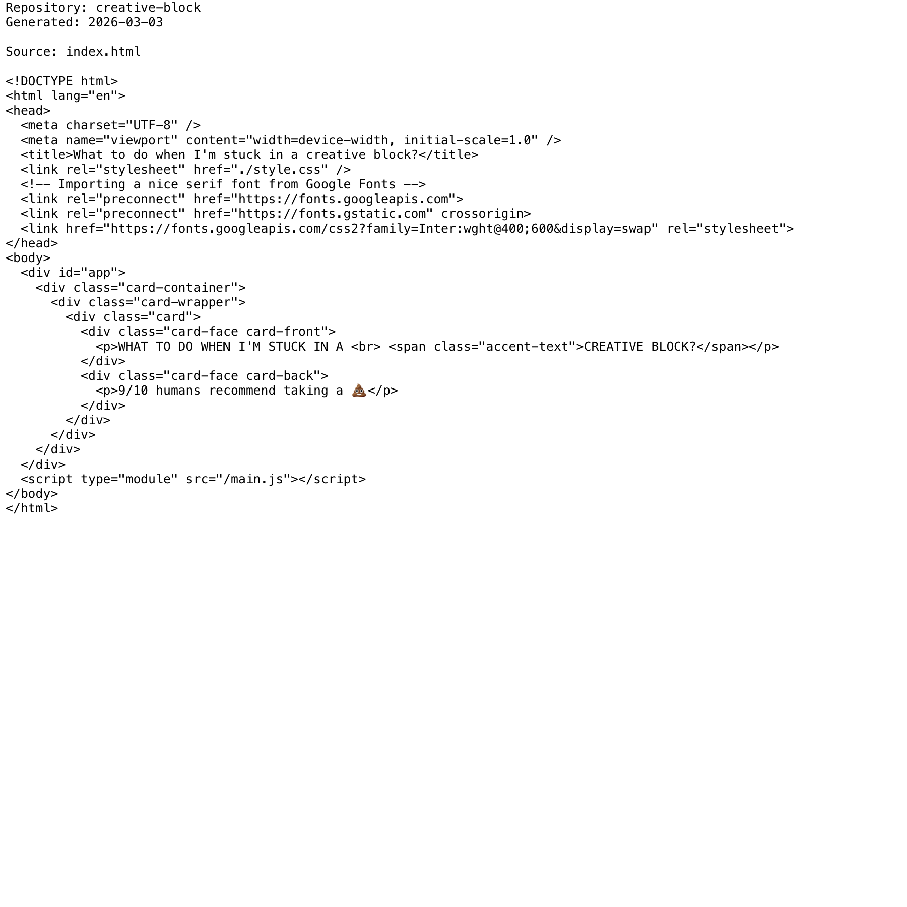

# Project Narrative & Proof

Generated: 2026-03-03

## User Journey
1. Discover the project value in the repository overview and launch instructions.
2. Run or open the build artifact for creative-block and interact with the primary experience.
3. Observe output/behavior through the documented flow and visual/code evidence below.
4. Reuse or extend the project by following the repository structure and stack notes.

## Design Methodology
- Iterative implementation with working increments preserved in Git history.
- Show-don't-tell documentation style: direct assets and source excerpts instead of abstract claims.
- Traceability from concept to implementation through concrete files and modules.

## Progress
- Latest commit: 84d62ee (2026-03-02) - docs: add professional README with badges
- Total commits: 2
- Current status: repository has baseline narrative + proof documentation and CI doc validation.

## Tech Stack
- Detected stack: Node.js, GitHub Actions, JavaScript, HTML/CSS

## Main Key Concepts
- Key module area: `public`
- Key module area: `src`

## What I'm Bringing to the Table
- End-to-end ownership: from concept framing to implementation and quality gates.
- Engineering rigor: repeatable workflows, versioned progress, and implementation-first evidence.
- Product clarity: user-centered framing with explicit journey and value articulation.

## Show Don't Tell: Screenshots


## Show Don't Tell: Code Excerpt
Source: `index.html`

```html
<!DOCTYPE html>
<html lang="en">
<head>
  <meta charset="UTF-8" />
  <meta name="viewport" content="width=device-width, initial-scale=1.0" />
  <title>What to do when I'm stuck in a creative block?</title>
  <link rel="stylesheet" href="./style.css" />
  <!-- Importing a nice serif font from Google Fonts -->
  <link rel="preconnect" href="https://fonts.googleapis.com">
  <link rel="preconnect" href="https://fonts.gstatic.com" crossorigin>
  <link href="https://fonts.googleapis.com/css2?family=Inter:wght@400;600&display=swap" rel="stylesheet">
</head>
<body>
  <div id="app">
    <div class="card-container">
      <div class="card-wrapper">
        <div class="card">
          <div class="card-face card-front">
            <p>WHAT TO DO WHEN I'M STUCK IN A <br> <span class="accent-text">CREATIVE BLOCK?</span></p>
          </div>
          <div class="card-face card-back">
            <p>9/10 humans recommend taking a 💩</p>
          </div>
        </div>
      </div>
    </div>
  </div>
  <script type="module" src="/main.js"></script>
</body>
</html>
```
